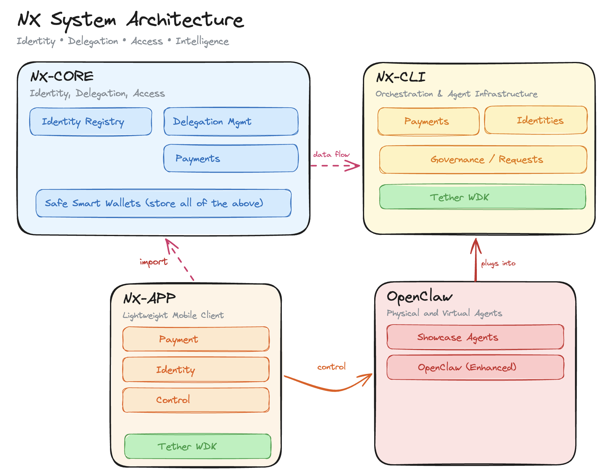

# Nexoid — Governed Autonomy for AI Agents

**On-chain identity, scoped delegation, Safe smart wallets with per-agent spending limits, and cryptographic identity proof — so operators can trust their agents to move real money.**

> Hackathon submission for [Tether Hackathon Galactica: WDK Edition 1](https://dorahacks.io/) — Track 1: Agent Wallets

## The Problem

AI agents are increasingly capable of autonomous decision-making, but today's infrastructure treats them as second-class citizens. There is no standard way for an agent to:

- **Prove its identity** to a counterparty or service
- **Spend money** within operator-defined guardrails
- **Be held accountable** for its on-chain actions
- **Derive keys deterministically** so operators can recover and audit agent wallets

Without these primitives, operators must either give agents unrestricted access to funds (dangerous) or manually approve every transaction (defeats the purpose of automation). The result: agents that can reason but cannot transact.

## The Solution

Nexoid is an identity, payment, and delegation infrastructure that turns AI agents into accountable economic actors on Ethereum. A single BIP-39 seed phrase (via Tether WDK) deterministically derives the operator's EOA and every agent's EOA — making the entire key hierarchy recoverable and auditable from one mnemonic.

Each agent gets:

- **A registered on-chain identity** — recorded in an IdentityRegistry contract on Ethereum, linked back to its operator
- **Scoped delegation** — budget limits, per-transaction caps, and expiry recorded on-chain in the DelegationRegistry, with chain-breaking revocation (revoke one link, every downstream agent is instantly invalidated)
- **A Safe smart wallet with EVM-enforced spending limits** — the AllowanceModule caps what each agent can spend per period. This is enforced by the EVM, not application logic. No prompt injection, no key theft, no bug can bypass it. An agent literally cannot overspend.
- **Cryptographic identity proof** — EIP-712 signed proofs let agents prove who they are and what they're authorized to do, without revealing unnecessary information

| Feature | Description |
|---------|-------------|
| **On-chain Identity** | Register operators and agents on the Ethereum IdentityRegistry, linked back to the operator |
| **Scoped Delegation** | Budget limits, per-transaction caps, and expiry on-chain in the DelegationRegistry — with chain-breaking revocation |
| **Safe Smart Wallets** | AllowanceModule caps per-agent spending per period, enforced by the EVM — no application-level bypass possible |
| **WDK Key Derivation** | Tether WDK provides BIP-44 HD key derivation (m/44'/60'/0'/0/{index}) — deterministic, recoverable agent keys from a single seed |
| **EIP-712 Identity Proof** | Agents generate verifiable cryptographic proofs of identity and delegation |
| **Mobile Wallet** | React Native app for operators to manage agents, monitor balances, and approve transactions on the go |

## Architecture



```
                          Tether WDK (BIP-39 Seed Phrase)
                                      |
                          BIP-44 HD Key Derivation
                         m/44'/60'/0'/0/{index}
                                      |
                 +--------------------+--------------------+
                 |                    |                    |
            index 0              index 1              index 2
         Operator EOA          Agent Alpha EOA       Agent Beta EOA
                 |                    |                    |
    +------------+-------+     +-----+-----+        +-----+-----+
    |                    |     |           |        |           |
  Safe{Wallet}     NX Platform |      Agent Safe   |      Agent Safe
  (1-of-1)        (Dashboard)  |      (1-of-1)     |      (1-of-1)
    |                          |           |        |           |
    +--- USDT balance          |    100 USDT/day    |    50 USDT once
    +--- AllowanceModule ------+--- per-agent ------+--- spending
    +--- NexoidModule              limits                limits
              |
    +---------+---------+
    |         |         |
 register  suspend   revoke
  agents    agents    agents
```

### On-chain Contracts (Ethereum Sepolia)

```
+---------------------+     +---------------------+     +---------------------+
|  IdentityRegistry   |     |    NexoidModule      |     |  AllowanceModule    |
|---------------------|     |---------------------|     |---------------------|
| registerIdentity()  |     | registerAgentSafe() |     | addDelegate()       |
| getIdentity()       |     | suspendAgent()      |     | setAllowance()      |
| isRegistered()      |     | revokeAgent()       |     | executeAllowance-   |
| updateMetadata()    |     | reactivateAgent()   |     |   Transfer()        |
|                     |     | getAgentSafes()     |     | getDelegates()      |
|                     |     | getAgentRecord()    |     | getTokenAllowance() |
+---------------------+     +---------------------+     +---------------------+
        ^                           ^                           ^
        |                           |                           |
   Operator Safe            Operator Safe                Agent Safe
   (owner call)             (module tx)                  (delegate spend)
```

### Data Flow

```
Operator                        On-chain                         Agent
   |                               |                               |
   |-- WDK init (seed phrase) ---->|                               |
   |   [derives all keys]          |                               |
   |                               |                               |
   |-- registerIdentity() ------->| IdentityRegistry              |
   |-- registerAgentSafe() ------>| NexoidModule                  |
   |-- addDelegate() ------------>| AllowanceModule               |
   |-- setAllowance(USDT,100) --->| AllowanceModule               |
   |                               |                               |
   |                               |<-- executeAllowanceTransfer() |
   |                               |    [spends within limit]      |
   |                               |                               |
   |<-- monitor via NX Platform ---|                               |
   |<-- monitor via NX Wallet -----|                               |
```

### Where Tether WDK is Used

Every on-chain action flows through WDK: deriving keys, signing transactions, executing USDT transfers, and wrapping accounts as EIP-1193 providers for Safe SDK compatibility.

| Layer | WDK Role |
|-------|----------|
| **Key Derivation** | BIP-44 HD path `m/44'/60'/0'/0/{index}` — single seed phrase deterministically derives operator EOA (index 0) and every agent EOA (index 1+). All keys are recoverable from one mnemonic. |
| **Transaction Signing** | `account.sendTransaction()` signs and broadcasts all on-chain transactions — identity registration, agent Safe deployment, delegation, allowance configuration. WDK manages nonce, gas estimation, and submission. |
| **USDT Transfers** | `account.sendTransaction({ to, data })` executes ERC-20 `transfer()` calls for USDT spending within allowance limits. WDK handles ABI encoding, gas estimation, and transaction receipt tracking. |
| **EIP-1193 Provider** | `WDKProviderAdapter` wraps the WDK account as a standard EIP-1193 provider, enabling Safe Protocol Kit integration. Handles `eth_signTypedData_v4` (Safe transaction signatures), `personal_sign` (message signing), `eth_sendTransaction` (broadcast), and `eth_accounts`/`eth_chainId` queries. |
| **Balance Queries** | `WalletManagerEvm.getBalance()` and token balance lookups provide real-time ETH and USDT balance information across operator and agent wallets. |
| **Safe Smart Wallets** | WDK-derived EOA serves as the sole signer (1-of-1) for both operator and agent Safe wallets. Safe Protocol Kit delegates all signing to WDK via the EIP-1193 adapter. |
| **NX Wallet (mobile)** | `WDKService` initializes WDK with seed, registers `ethereum` chain via `WalletManagerEvm`. Provides address derivation, transaction signing, USDT transfers, and fee estimation to the React Native UI. |
| **NX Platform (dashboard)** | WDK derives operator keys and signs Safe module transactions (agent registration, suspension, revocation). |
| **Core Client SDK** | `NexoidClient.fromSeedPhrase()` uses WDK for deterministic key derivation across all agent indices, enabling programmatic agent management. |
| **CLI (nxcli)** | Agent creation, delegation, allowance setting, and USDT sending — all signed and broadcast via WDK. |

## Project Structure

```
packages/
  nx-core/        — Solidity contracts + TypeScript wrappers
  core-client/    — NexoidClient SDK (identity, delegation, wallet, proof, WDK)
  nx-cli/         — CLI tool (nxcli)
apps/
  nx-platform/    — Operator dashboard (Next.js)
  nx-verify/      — Public identity explorer & proof verifier (Next.js)
  nx-wallet/      — Mobile wallet app (React Native / Expo, WDK + Safe)
scripts/          — Demo setup scripts (01-07)
demo/             — Agent demo scenario
```

## Quick Start

```bash
# Prerequisites: Node.js >=22, pnpm >=9

# Install dependencies
pnpm install

# Build all packages
pnpm build

# Run contract tests (174 passing)
cd packages/nx-core && npx hardhat test

# Start the operator dashboard
cd apps/nx-platform && pnpm dev   # http://localhost:3100

# Start the identity explorer
cd apps/nx-verify && pnpm dev     # http://localhost:3200

# Start the mobile wallet (Expo)
cd apps/nx-wallet && npx expo start
```

## CLI Usage

```bash
# Initialize CLI config
nxcli init --rpc-url https://ethereum-sepolia-rpc.publicnode.com \
  --registry 0x... --nexoid-module 0x...

# Register identity + deploy Safe
nxcli register

# Create an agent (WDK-derived key)
nxcli agent create --label "Agent Alpha"

# Delegate scope to agent
nxcli delegate 0xAgentSafeAddress --budget 100 --max-tx 50

# Set allowance on Safe
nxcli set-allowance did:nexoid:eth:0x... 100 --reset 1440

# Agent: send USDT (within allowance)
nxcli send 0xRecipient 10

# Agent: generate identity proof
nxcli credential prove --verifier 0x...

# Agent: request additional funds
nxcli request-funds --amount 500 --reason "API subscription payment"
```

## Tech Stack

| Component | Technology |
|-----------|-----------|
| Smart Contracts | Solidity 0.8.24, Hardhat |
| Wallet SDK | Tether WDK (BIP-44 HD derivation via ethers.js v6) |
| Smart Wallet | Safe{Wallet} Protocol Kit v6.1.2 + AllowanceModule |
| Client SDK | TypeScript, viem v2.21 |
| CLI | Commander.js, chalk |
| Dashboard | Next.js 15, React 19, viem |
| Mobile Wallet | React Native (Expo 54), WDK + Safe Protocol Kit, ethers.js v6 |
| Chain | Ethereum Mainnet / Sepolia |
| Token | USDT (Tether USD) |

## Environment Variables

Copy `.env.example` to `.env` and fill in values. Key variables:

```
DEPLOYER_PRIVATE_KEY=     # For contract deployment
NEXOID_PRIVATE_KEY=       # For CLI operations
NEXOID_SEED_PHRASE=       # WDK seed phrase (BIP-39)
ETH_SEPOLIA_RPC_URL=      # Ethereum Sepolia RPC
```

## Demo Setup

Run the setup scripts in order:
```bash
HARDHAT_NETWORK=sepolia tsx scripts/01-deploy-contracts.ts
tsx scripts/02-register-operator.ts
tsx scripts/03-create-agents.ts
tsx scripts/05-deploy-safe.ts
tsx scripts/06-set-allowances.ts
tsx scripts/07-fund-agents-eth.ts
```

Then run the agent demo:
```bash
tsx demo/agent-scenario.ts
```
