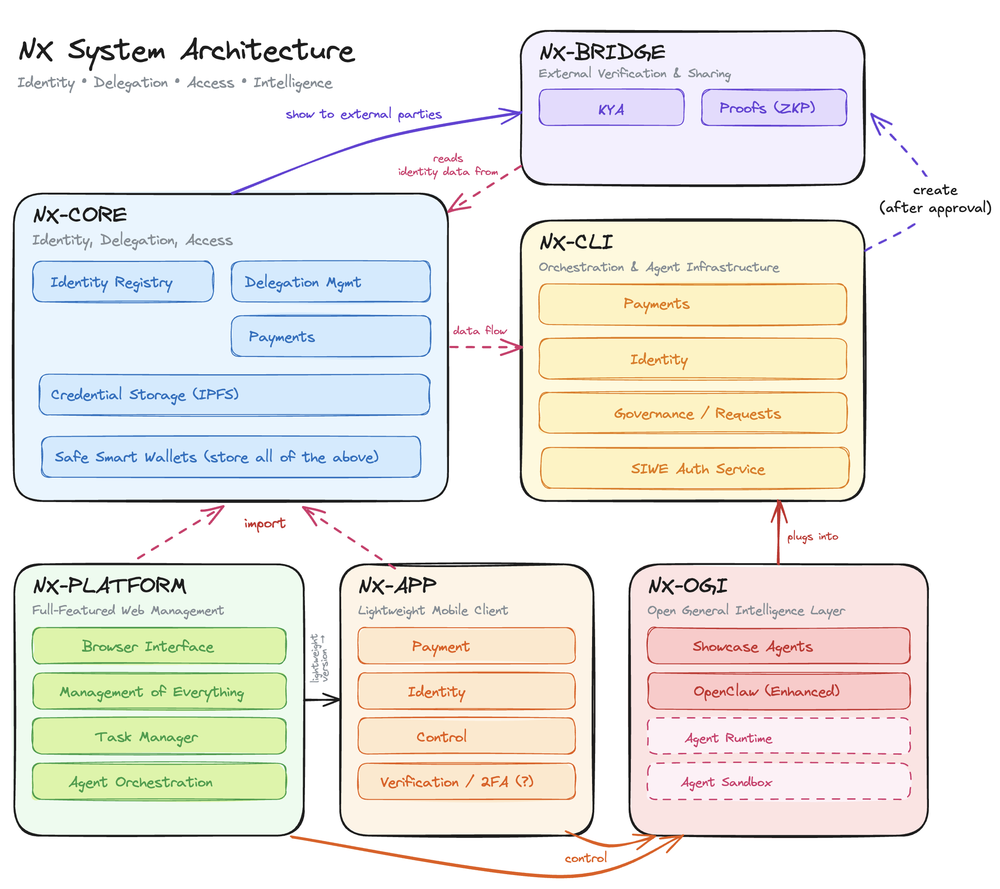

<p align="center">
  
</p>

# Nexoid — Governed Autonomy for AI Agents

**On-chain identity, scoped delegation, Safe smart wallets with EVM-enforced spending limits, and cryptographic proofs — so operators can trust their agents to move real money.**

## Demo

https://www.youtube.com/watch?v=3Ni5vfM9oqs

## The Problem

AI agents are becoming economic actors. They trade on DEXes, execute procurement, pay for APIs, and settle invoices — billions of dollars already move through autonomous agents, and over half of internet traffic is now bots. But the infrastructure treats them as second-class citizens.

An operator deploying an agent today has two bad options: hand it a hot wallet and hope nothing goes wrong, or wrap every action in human approval. There is no middle ground because four foundational primitives are missing:

| Gap | What's missing |
|-----|----------------|
| **Identity** | No standardized way to prove *who* authorized an agent, or trace it back to a real organization |
| **Control** | All-or-nothing access — agents can either do everything or nothing |
| **Financial Governance** | No pre-execution spending controls — budgets are checked *after* the damage |
| **Audit** | No tamper-proof record of what the agent did, or under whose authority |

These gaps compound. A procurement agent with a stolen API key can impersonate a legitimate buyer, exceed any budget, and leave no auditable trail — **one compromise, four failures, one incident.** Arup lost $25.6M to a single AI impersonation in 2024; no system could distinguish the attacker from a legitimate actor.

The result: agents that can reason but cannot be trusted to transact.

## The Solution

Nexoid is the identity, payment, and governance protocol for accountable AI agents on Ethereum. **One verification confirms** an agent's identity, delegation chain, scope, and spending limits — backed by EVM-enforced guardrails that no prompt injection or compromised key can bypass.

Four primitives, one protocol:

- **On-chain identity** — Operators and agents are registered in the `IdentityRegistry` contract, linked to a verifiable corporate delegation chain. Aligned with [ERC-8004](https://eips.ethereum.org/EIPS/eip-8004) for trustless agent identity.
- **Scoped delegation** — Per-agent budget caps, per-transaction limits, and expiry recorded on-chain via the `NexoidModule`. Chain-breaking revocation: revoke one link and every downstream agent is invalidated in a single transaction, regardless of tree depth.
- **EVM-enforced spending limits** — Every agent operates from a Safe smart wallet. The `AllowanceModule` caps what an agent can spend per period. **The limit is enforced by the EVM, not application logic.** No prompt injection, no key theft, no software bug can bypass it. An agent literally cannot overspend.
- **Cryptographic proofs** — EIP-712 signed credentials let agents prove identity and authorization to counterparties without revealing operator details, budgets, or delegation internals. Selective disclosure by design.

**Open verification.** Trust anchors live on Ethereum. Any counterparty can verify independently via the open-source verification SDK — no Nexoid runtime dependency, no vendor lock-in.

**Built for the agent stack.** Nexoid plugs into the protocols agents already use — [MCP](https://modelcontextprotocol.io) (Anthropic) as the agent-tool interface, and emerging payment standards like [x402](https://x402.org) (Coinbase) and AP2 (Google). Any MCP-compatible agent framework can connect to a governed tool surface without adopting a new protocol — and for everything else, `nxcli` lets any agent runtime shell out to the same primitives.

| Feature | Description |
|---------|-------------|
| **On-chain Identity** | Operators and agents registered in the `IdentityRegistry` on Ethereum, linked back to the operator |
| **Scoped Delegation** | Budget limits, per-transaction caps, and expiry on-chain via `NexoidModule` — with chain-breaking revocation |
| **Safe Smart Wallets** | `AllowanceModule` caps per-agent spending per period, enforced by the EVM — no application-level bypass possible |
| **EIP-712 Identity Proof** | Agents generate verifiable cryptographic proofs of identity and delegation, with selective disclosure |
| **Open Verification SDK** | TypeScript verification SDK — counterparties verify on-chain without depending on Nexoid infrastructure |
| **MCP-native Control Plane** | Agents connect via Anthropic's Model Context Protocol; every action checked against delegation scope before execution |
| **Mobile Wallet** | React Native app for operators to manage agents, monitor balances, and approve out-of-scope transactions |

## Architecture



Nexoid is organized as six modules with bottom-up trust inheritance — every layer extends the guarantees of the layer below, and agents interact only with the orchestration layer.

| Module | Role |
|--------|------|
| **NX-Core** | Identity, delegation, and access primitives — `IdentityRegistry`, delegation management, payments, credential storage (IPFS), and Safe smart wallets |
| **NX-Bridge** | External verification and credential sharing — KYA exchange, EIP-712 proofs, and (future) zero-knowledge proofs for selective disclosure |
| **NX-CLI** | Orchestration and agent infrastructure — payments, identity, governance/requests, and SIWE auth; the gateway agents connect through |
| **NX-Platform** | Full-featured web management — operator dashboard, task manager, and agent orchestration |
| **NX-APP** | Lightweight mobile client — payment, identity, control, and 2FA / out-of-scope approvals |
| **NX-OGI** | Open General Intelligence layer — showcase agents, agent runtime, and sandbox; plugs into NX-CLI |

### On-chain Contracts (Ethereum Mainnet & Sepolia)

```
+---------------------+     +---------------------+     +---------------------+
|  IdentityRegistry   |     |    NexoidModule     |     |  AllowanceModule    |
|---------------------|     |---------------------|     |---------------------|
| registerIdentity()  |     | registerAgentSafe() |     | addDelegate()       |
| getIdentity()       |     | suspendAgent()      |     | setAllowance()      |
| isRegistered()      |     | revokeAgent()       |     | executeAllowance-   |
| updateMetadata()    |     | reactivateAgent()   |     |   Transfer()        |
|                     |     | getAgentSafes()     |     | getDelegates()      |
|                     |     | getAgentRecord()    |     | getTokenAllowance() |
+---------------------+     +---------------------+     +---------------------+
        ^                           ^                           ^
        |                           |                           |
   Operator Safe            Operator Safe                Agent Safe
   (owner call)             (module tx)                  (delegate spend)
```

### Data Flow

```
Operator                        On-chain                         Agent
   |                               |                               |
   |-- registerIdentity() -------->| IdentityRegistry              |
   |-- registerAgentSafe() ------->| NexoidModule                  |
   |-- addDelegate() ------------->| AllowanceModule               |
   |-- setAllowance(USDT,100) ---->| AllowanceModule               |
   |                               |                               |
   |                               |<-- executeAllowanceTransfer() |
   |                               |    [spends within limit]      |
   |                               |                               |
   |<-- monitor via NX Platform ---|                               |
   |<-- monitor via NX Wallet -----|                               |
```

## Project Structure

```
packages/
  nx-core/        — Solidity contracts + TypeScript wrappers
  core-client/    — NexoidClient SDK (identity, delegation, wallet, proof)
  nx-cli/         — CLI tool (nxcli)
apps/
  nx-platform/    — Operator dashboard (Next.js)
  nx-verify/      — Public identity explorer & proof verifier (Next.js)
  nx-wallet/      — Mobile wallet app (React Native / Expo, Safe)
scripts/          — Demo setup scripts (01-07)
demo/             — Agent demo scenario
```

## Quick Start

```bash
# Prerequisites: Node.js >=22, pnpm >=9

# Install dependencies
pnpm install

# Build all packages
pnpm build

# Run contract tests (174 passing)
cd packages/nx-core && npx hardhat test

# Start the operator dashboard
cd apps/nx-platform && pnpm dev   # http://localhost:3100

# Start the identity explorer
cd apps/nx-verify && pnpm dev     # http://localhost:3200

# Start the mobile wallet (Expo)
cd apps/nx-wallet && npx expo start
```

## CLI Usage

```bash
# Initialize CLI config
nxcli init --rpc-url https://ethereum-sepolia-rpc.publicnode.com \
  --registry 0x... --nexoid-module 0x...

# Register identity + deploy Safe
nxcli register

# Create an agent
nxcli agent create --label "Agent Alpha"

# Delegate scope to agent
nxcli delegate 0xAgentSafeAddress --budget 100 --max-tx 50

# Set allowance on Safe
nxcli set-allowance did:nexoid:eth:0x... 100 --reset 1440

# Agent: send USDT (within allowance)
nxcli send 0xRecipient 10

# Agent: generate identity proof
nxcli credential prove --verifier 0x...

# Agent: request additional funds
nxcli request-funds --amount 500 --reason "API subscription payment"
```

## Tech Stack

| Component | Technology |
|-----------|-----------|
| Smart Contracts | Solidity 0.8.24, Hardhat |
| Smart Wallet | Safe{Wallet} Protocol Kit v6.1.2 + AllowanceModule |
| Client SDK | TypeScript, viem v2.21, ethers.js v6 |
| CLI | Commander.js, chalk |
| Dashboard | Next.js 15, React 19, viem |
| Mobile Wallet | React Native (Expo 54), Safe Protocol Kit, ethers.js v6 |
| Agent Interface | MCP (Model Context Protocol) |
| Identity Standard | ERC-8004 alignment, EIP-712 proofs |
| Chain | Ethereum Mainnet / Sepolia |
| Token | USDT (Tether USD) |

## Standards Alignment

| Standard | Creator | Status | Use in Nexoid |
|----------|---------|--------|---------------|
| **ERC-8004** (Trustless Agents) | MetaMask, Ethereum Foundation, Google, Coinbase | Draft ERC | Identity registry alignment |
| **MCP** (Model Context Protocol) | Anthropic | Production | Control Plane / agent gateway protocol |
| **EIP-712** (Typed signed data) | Ethereum | Final | Agent identity & delegation proofs |
| **x402** (Agent Payments) | Coinbase | Production | Payment integration target |
| **AP2** (Agent Payments) | Google | Developer preview | Future payment integration |

## Environment Variables

Copy `.env.example` to `.env` and fill in values. Key variables:

```
DEPLOYER_PRIVATE_KEY=     # For contract deployment
NEXOID_PRIVATE_KEY=       # For CLI operations
ETH_MAINNET_RPC_URL=      # Ethereum Mainnet RPC
ETH_SEPOLIA_RPC_URL=      # Ethereum Sepolia RPC
```

## Demo Setup

Run the setup scripts in order:
```bash
HARDHAT_NETWORK=sepolia tsx scripts/01-deploy-contracts.ts
tsx scripts/02-register-operator.ts
tsx scripts/03-create-agents.ts
tsx scripts/05-deploy-safe.ts
tsx scripts/06-set-allowances.ts
tsx scripts/07-fund-agents-eth.ts
```

Then run the agent demo:
```bash
tsx demo/agent-scenario.ts
```
